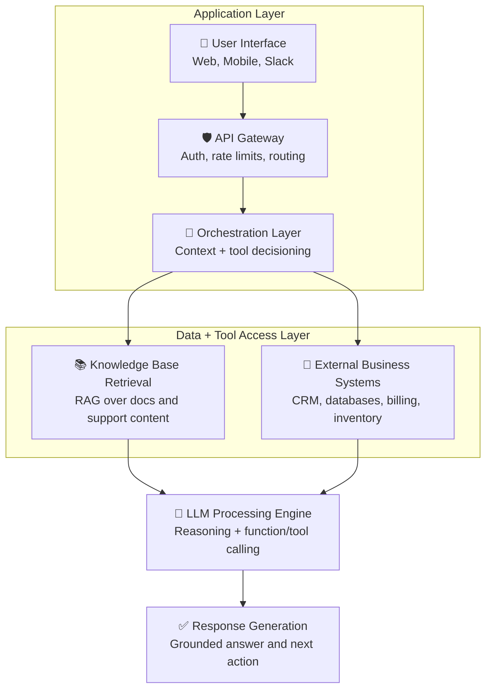

Generic chatbots are frustrating. They can't answer questions about your products, don't know your policies, and constantly redirect users to human support. But building a ChatGPT-style interface trained on your specific business data? That's a different story entirely.

In this guide, I'll walk through how to build custom AI assistants that actually understand your business—from architecture decisions to production deployment.

## Why Custom Chatbots Beat Generic Solutions

The difference between a generic chatbot and a custom AI assistant:

**Generic chatbot**: "I'm sorry, I don't have information about your order. Please contact support."

**Custom AI assistant**: "I found your order #12847. It shipped yesterday via FedEx and is estimated to arrive Thursday. Would you like the tracking link?"

The custom assistant knows your order system, understands your product catalog, and can actually help customers. That's the goal we're building toward.

## Architecture Overview

A production-ready custom chatbot has several components:



Let's break down each piece.

## Step 1: Building Your Knowledge Base

The knowledge base is what makes your chatbot actually useful. It contains all the information your chatbot can reference when answering questions.

### What to Include

- **Product documentation**: Features, specifications, pricing, comparisons
- **Support articles**: FAQs, troubleshooting guides, how-to content
- **Policy documents**: Shipping, returns, warranties, terms of service
- **Training materials**: Sales scripts, objection handling, positioning
- **Historical tickets**: Successful resolutions (anonymized)

### How to Structure It

I use a vector database to store and retrieve knowledge. The process:

1. **Chunking**: Split documents into semantically meaningful chunks (500-1000 tokens typically)
2. **Embedding**: Convert each chunk to a vector using OpenAI embeddings
3. **Indexing**: Store vectors in Pinecone, Weaviate, or pgvector
4. **Retrieval**: When a user asks a question, find the most relevant chunks

This is called RAG (Retrieval-Augmented Generation). Instead of relying on the LLM's training data, we retrieve your specific information and include it in the prompt.

## Step 2: Connecting External Systems

A truly useful assistant needs live data—not just static documentation.

Common integrations:

- **Order management**: Look up order status, tracking, history
- **CRM**: Pull customer information, past interactions, account details
- **Inventory**: Check product availability, lead times
- **Scheduling**: Book appointments, check availability
- **Billing**: Retrieve invoices, payment status

Each integration is a "tool" the LLM can call. Modern frameworks like LangChain make this straightforward:

```typescript
const tools = [
  {
    name: "lookup_order",
    description: "Look up order status by order ID or customer email",
    parameters: {
      order_id: { type: "string" },
      email: { type: "string" }
    },
    execute: async (params) => {
      return await orderSystem.lookup(params);
    }
  }
];
```

The LLM decides when to call tools based on user queries—no hardcoded intent detection needed.

## Step 3: Orchestration Layer

The orchestration layer manages the conversation flow:

1. Receive user message
2. Retrieve relevant knowledge (RAG)
3. Determine if tools are needed
4. Call LLM with context + tools
5. Execute any tool calls
6. Generate final response
7. Update conversation history

Key decisions:

**Conversation memory**: How much history to include? I typically use a sliding window of the last 10-15 messages, plus a summary of earlier context.

**System prompt**: This defines your bot's personality, boundaries, and behavior. Invest time here—it dramatically affects quality.

**Fallback handling**: What happens when the bot can't answer? Graceful escalation to humans, not frustrating dead ends.

## Step 4: Safety and Guardrails

Production chatbots need safeguards:

**Input validation**: Filter malicious prompts, PII, and out-of-scope requests before they reach the LLM.

**Output filtering**: Check responses for sensitive information, hallucinations, and off-brand content.

**Confidence thresholds**: If the model isn't confident in an answer, trigger human handoff instead of guessing.

**Rate limiting**: Prevent abuse and manage API costs.

**Logging and monitoring**: Track every conversation for quality review and improvement.

## Step 5: User Interface

The interface depends on your use case:

**Website widget**: For customer support, embed a chat widget. Libraries like Chatwoot or custom React components work well.

**Internal tools**: Slack or Teams integrations put the assistant where your team already works.

**API-first**: Some implementations are headless—powering multiple interfaces from one backend.

Key UX considerations:

- Show typing indicators during processing
- Display sources/citations for transparency
- Enable feedback collection (thumbs up/down)
- Provide clear escalation paths to humans
- Handle multi-turn conversations gracefully

## Common Mistakes to Avoid

**Training on insufficient data**: If your knowledge base is thin, your bot will be thin. Invest in comprehensive documentation before building the chatbot.

**Ignoring edge cases**: The first 80% is easy. Production readiness means handling the weird 20%—malformed inputs, adversarial prompts, and unexpected questions.

**No human oversight**: AI should augment humans, not replace judgment. Build in review workflows, especially early on.

**Skipping testing**: Test with real users before launch. What seems clear to you may confuse customers.

**Static deployment**: Your business changes. Build update mechanisms so the knowledge base stays current.

## The Build vs. Buy Decision

Should you build custom or use platforms like Intercom's AI, Zendesk AI, or Drift?

**Build custom when**:
- You need deep integration with proprietary systems
- You have unique data that platforms can't access
- You want full control over the AI behavior
- You're handling sensitive data requiring on-premise deployment

**Use platforms when**:
- You need something quickly with limited engineering resources
- Your use case is standard support/sales
- You don't have proprietary data to leverage
- You want vendor-managed infrastructure

For most businesses with unique data and specific requirements, custom builds deliver superior results.

## Getting Started

Start small and iterate:

1. **Week 1-2**: Build knowledge base from existing documentation
2. **Week 3**: Implement basic RAG-powered responses
3. **Week 4**: Add one critical integration (e.g., order lookup)
4. **Week 5-6**: Internal testing and refinement
5. **Week 7-8**: Soft launch with monitoring

Each phase delivers learning that shapes the next.
